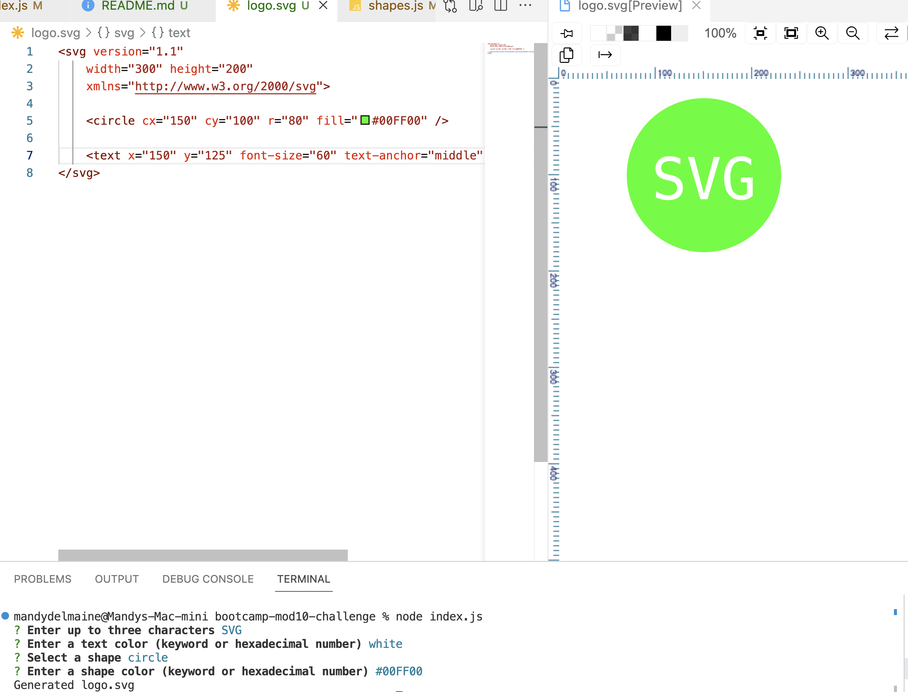

# 10 SVG Logo Maker

## Description 
For the module 10 assignment I built an SVG logo maker in JavaScript. The application uses Node along with the Inquirer package to create the SVG file by collecting user input via the command line. 

A demo of the tool can be found here: https://drive.google.com/file/d/1VXII5r-Szw5PaaXYeyOzPzqxXsSnuqpg/view

## Installation
To install node on mac, use `brew install nvm` and `nvm install 16`.
Use `npm install` to install the inquirer package / required packages.

## Usage
The user will need to type `node index.js` on the command line to launch a series of questions. Once the questions are answered, SVG logo is generated and is saved to "logo.svg" which can be viewed in a web browser.

## User Story

```
AS a freelance web developer
I WANT to generate a simple logo for my projects
SO THAT I don't have to pay a graphic designer
```

## Acceptance Criteria 

```
GIVEN a command-line application that accepts user input
WHEN I am prompted for text
THEN I can enter up to three characters
WHEN I am prompted for the text color
THEN I can enter a color keyword (OR a hexadecimal number)
WHEN I am prompted for a shape
THEN I am presented with a list of shapes to choose from: circle, triangle, and square
WHEN I am prompted for the shape's color
THEN I can enter a color keyword (OR a hexadecimal number)
WHEN I have entered input for all the prompts
THEN an SVG file is created named `logo.svg`
AND the output text "Generated logo.svg" is printed in the command line
WHEN I open the `logo.svg` file in a browser
THEN I am shown a 300x200 pixel image that matches the criteria I entered
```

## Mock-Up

The following image shows the web application's appearance and functionality:



